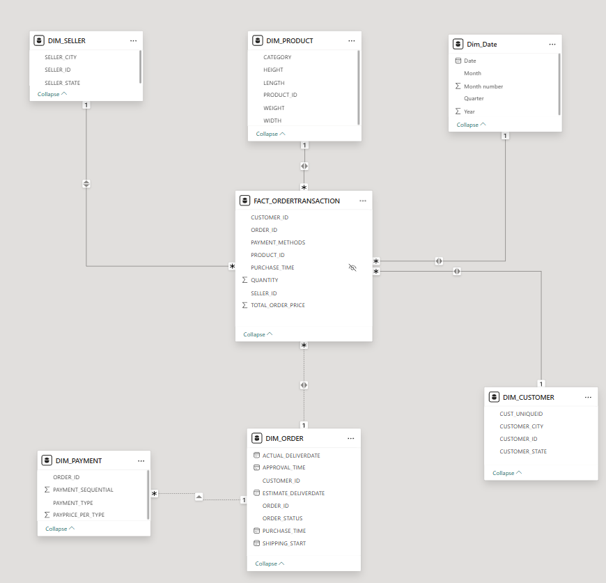

# E-Commerce Datawarehouse 

This repository contains a data engineering project that aims to build a centralized data warehouse for business analysis and implements an ELT (Extract,Load, Transform) data pipeline. The goal of project is to extract and load data related E-Commerce by Olist store into datawarehouse, tranform structured dataset for designing data modelling as Star schema. This structure allows for fast queries and efficient reporting in BI tools.
> **Cre(dataset):** https://www.kaggle.com/datasets/olistbr/brazilian-ecommerce?select=olist_order_items_dataset.csv

## Data Workflow
1. Source data is extracted and loaded into data warehouse by using Airbyte
2. Transform the data using DBT (Star schema modeling, deduplication, aggregation)
3. Analyze and visualize insights in BI tool  
Dagster is used to orchestrate the data ingestion first. After all the raw data is loaded in Snowflake, let dbt start the transformation task.

## Technology Stack
- PostgresSQL: An open-source relational database management system
- Airbyte: An open-source data integration platform designed to consolidate data from various sources into data warehouses, lakes, and databases
- Dagster:  A modern data orchestration platform designed to build, test, and deploy data pipelines
- DBT: An open-source command line tool to transform data in a warehouse
- Snowflake: A cloud-based data warehousing platform designed for scalability, flexibility, and ease of use
- PowerBI: An interactive data visualization software
## Project Structure
* DW_dagster: contains dagster project definition
* models, staging, marts: contains dbt models defining staging, dimension and fact tables
## Data Modeling

> **Model view of star schema**
 
After uploading all fact and dimension tables in Power BI, I realize that dim_payment is not a real dimension. In some order_ids products can purchased by more than one payment types, I merge chosen payment types into list for each order_id in fact table. A dimension table Dim_Date is added. 

## Dashboard

Analysing trends and performing data insights

